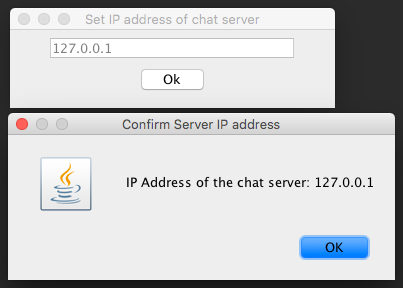
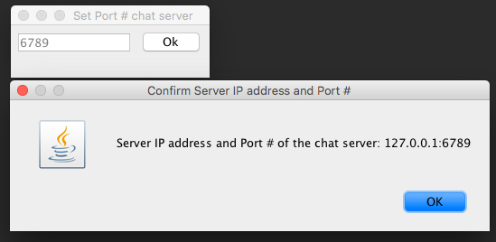
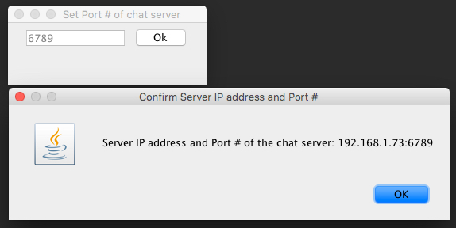
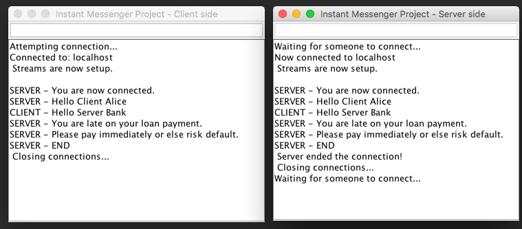
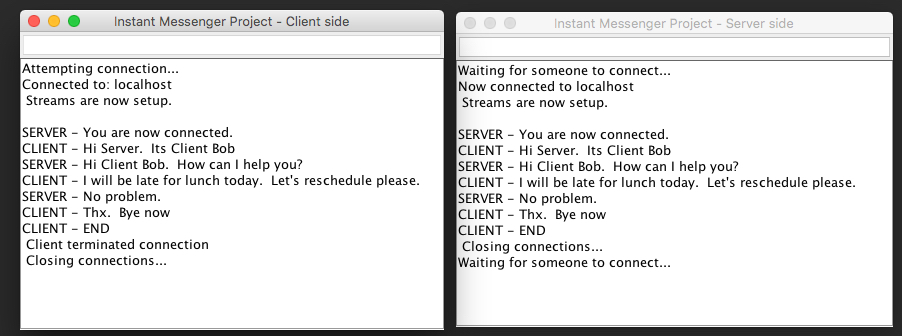

# Java Instant Messaging Project: Streams and Sockets
This project is a simple Java (Swing based) Instant Messenger (IM) application that utilizes Streams and Sockets.

It consists of both a Server side and a Client side application, each of which are installed on different machines. Up to 100 client session can be connected at any time. The default port is 6789.

The client connected chat session will continue until the client types 'END' in the session.

## Getting Started

These instructions will explain how to clone a copy of the project up and running on both the server and client machines.

### Prerequisites
For full details on the mechanics of how a Client - Server works, please perform a simple search on Google, as there is an almost infinite amount of resources available.

### Installing

* Project location is on Github. Clone the [remote master repo] (https://github.com/derekmegyesi/Java-Instant-Messaging-Project_Streams-Sockets.git). This will be the Repo Home directory.

```
./Java-Instant-Messaging-Project_Streams-Sockets/<Repo Home>
```
* Install a Java SDK (located at [Oracle Java SE Downloads)] (http://www.oracle.com/technetwork/java/javase/downloads/index.html). Java 1.8 was used to build this project.
* Optionally, a Java IDE can also be used to run the project.  This project was built using [IntelliJ Ultimate Edition 2017.3] (https://www.jetbrains.com/idea/), and [Eclipse] (http://www.eclipse.org/downloads/eclipse-packages/) is another commonly used IDE.

## Running the Java IM application
* The project is divided into two individual sub-projects (Server and Client), each of which needs to be run independently of each other.
	
```
<Repo Home>/JavaIM-ClientSide 
<Repo Home>/JavaIM-ServerSide
```
### Server side
* Run the Server side application, by running the Server jar file on machine A.

```
java -jar <Repo Home>/JavaIM-ServerSide/out/artifacts/JavaIM_ServerSide_jar/JavaIM-ServerSide.jar
```

### Client side
* Run the Client side application, by running the Client jar file on machine b.

```
java -jar <Repo Home>/JavaIM-ClientSide/out/artifacts/JavaIM_ClientSide_jar/JavaIM-ClientSide.jar
```

### Operation
##### Server side startup
* Upon running the Server application, enter the port number of the running Server application (default is 6789).

##### Client side startup
* Upon running the Client application, enter both the IP address and the port number of the running Client application (default is 127.0.0.1:6789).

##### Chat session
* Enter *Text* phrases on any of the deployed (and running) client applications.
* The client connected chat session will continue until one of the users type *END* in the session.

## Screenshots
##### Client side


##### Server side

##### Chat session


